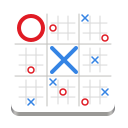

# Ultimate tactic
  [](https://www.gnu.org/licenses/gpl-3.0)
  [](https://www.python.org/)
  [](https://flathub.org/apps/details/io.github.nokse22.ultimate-tic-tac-toe)
  
  <p>
    Play Ultimate Tic Tac Toe.
	  
You can play with your friends or play against a simple algorithm.

It is using the minimax algorithm. It works by recursively exploring all possible moves and their outcomes to determine the best move. The algorithm operates under the assumption that both players play optimally, making the best moves for themselves. This algorithm only sees the game it can plays in, it doesn't take into consideration what his moves can cause. If the algorithm can choose any game to play in, it will choose the one that is most needed to win. It is still a very simple algorithm, in the future I will try to improve it.
	</p>
	  <details><summary>Rules from <a href="https://en.wikipedia.org/wiki/Ultimate_tic-tac-toe">Wikipedia</a></summary>
		  <p>
			  
Just like in regular tic-tac-toe, the two players (X and O) take turns, starting with X. The game starts with X playing wherever they want in any of the 81 empty spots. Next the opponent plays, however they are forced to play in the small board indicated by the relative location of the previous move. For example, if X plays in the top right square of a small (3 × 3) board, then O has to play in the small board located at the top right of the larger board. Playing any of the available spots decides in which small board the next player plays.
			  
If a move is played so that it is to win a small board by the rules of normal tic-tac-toe, then the entire small board is marked as won by the player in the larger board. Once a small board is won by a player or it is filled completely, no more moves may be played in that board. If a player is sent to such a board, then that player may play in any other board. Game play ends when either a player wins the larger board or there are no legal moves remaining, in which case the game is a draw.
	  </p>
   </details>


  <div align="center">
  
  </div>

## Installation
### Tactics is available on
<a href='https://flathub.org/apps/io.github.nokse22.ultimate-tic-tac-toe'></a>
<h>&emsp;</h> <a href="https://snapcraft.io/tactics"></a>

### From source

You just need to clone the repository

```sh
git clone https://github.com/Nokse22/ultimate-tic-tac-toe.git
```

Open the project in GNOME Builder and click "Run Project".
